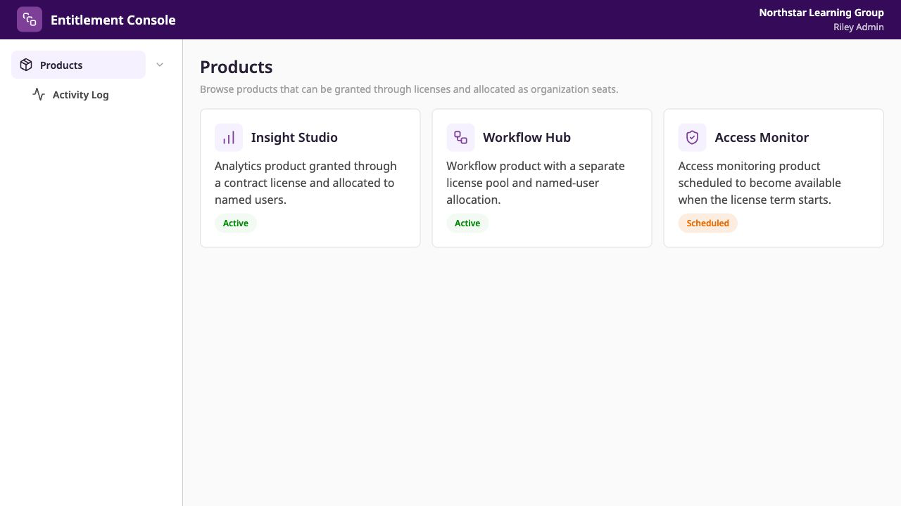
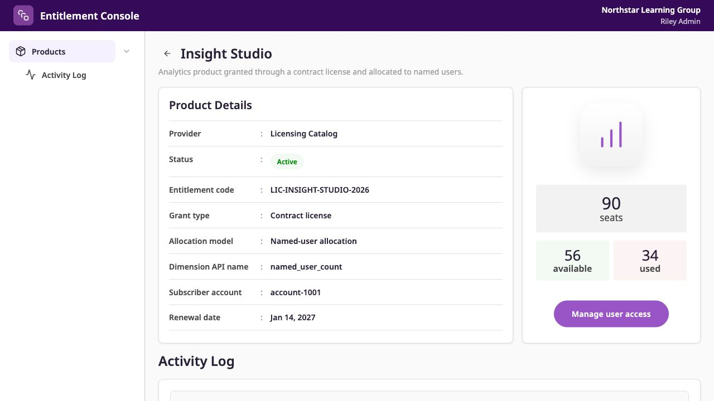
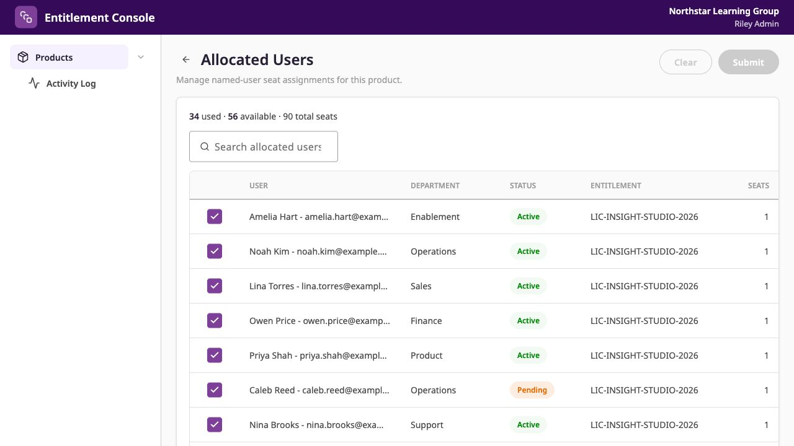
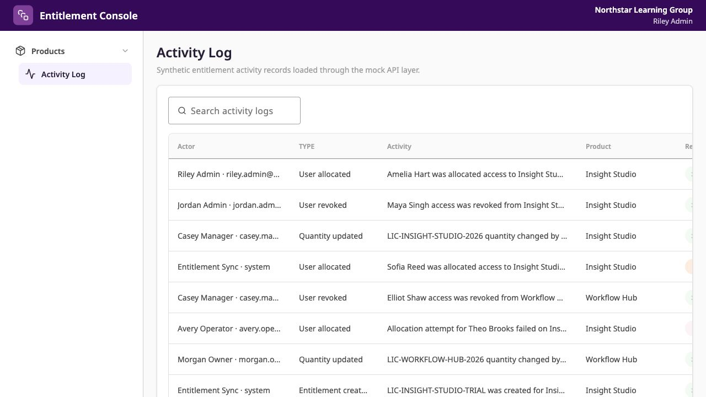

# Entitlement Console

Standalone Vue 3 portfolio app for B2B entitlement management.

This repository contains a desensitized admin console for product entitlement management. Products are the primary navigation surface; allocated users, available quantity, usage dimensions, and Activity Log views are presented around the product workflow.

The app uses synthetic mock data only and does not connect to a real backend.

## Feature Highlights

- Product catalog with status, provider, and entitlement metadata.
- Product detail workflow with entitlement summary and seat availability.
- Allocated user management with search, draft selection, and capacity validation.
- Activity Log views backed by normalized synthetic audit events.
- English and Chinese locale support through `vue-i18n`.

## Screenshots

### Products



### Product Detail



### Allocated Users



### Activity Log



## Related Portfolio Projects

This project is part of the same portfolio SaaS system as [HugoHZXu/saas-admin-dashboard-portfolio](https://github.com/HugoHZXu/saas-admin-dashboard-portfolio).

Conceptually, this entitlement console represents another product surface in the same B2B SaaS administration domain. If it were built with the same frontend stack and integration conventions as the SaaS admin dashboard, it could fit into that portfolio as a workspace-level module within the shared data model and micro frontend architecture.

This repository is intentionally kept as a standalone Vue 3 and Tailwind CSS application so I can practice building a focused product experience with a different frontend stack while preserving the same desensitized SaaS domain model.

## Tech Stack

- Vue 3 and TypeScript
- Vite
- Vue Router
- Pinia
- TanStack Vue Query
- TanStack Table
- Tailwind CSS v4
- `@hugo-ui/shadcn-vue`
- `vue-i18n`
- Vitest
- Playwright
- ESLint and Prettier
- pnpm

## Development

This project expects Node.js `>=22.12.0` and pnpm `>=10.34.1 <11`.

```bash
pnpm install
pnpm run dev
```

Common validation commands:

```bash
pnpm run typecheck
pnpm run lint
pnpm run test
pnpm run build
pnpm run verify
```

## Design System

The UI is built with [`@hugo-ui/shadcn-vue`](https://github.com/HugoHZXu/hugo-ui), which comes from the external [HugoHZXu/hugo-ui](https://github.com/HugoHZXu/hugo-ui) design system repository.

This repository consumes Hugo UI as an application dependency. It does not own the design system source code, component library publishing flow, Storybook setup, or package release process.

For local development, the app can optionally link to a local clone of `hugo-ui` through the ignored local symlink workflow:

```bash
pnpm run setup:local-hugo-ui
pnpm run verify:hugo-ui
```

## Project Structure

- `src/app`: Vue application entry, providers, global styles, and i18n setup.
- `src/routes`: Vue Router configuration.
- `src/layouts`: application shell layout.
- `src/pages`: route-level product, allocated user, and Activity Log pages.
- `src/features`: feature-local UI composition, display helpers, composables, stores, and styles.
- `src/shared/api`: mock API functions and normalization logic.
- `src/shared/mocks`: synthetic product, entitlement, allocated user, and Activity Log data.
- `src/shared/types`: shared business view models.

## Portfolio Safety

This is a desensitized portfolio project. It preserves reusable SaaS administration patterns without including private implementation details.

- All product, entitlement, user, and audit data is synthetic.
- The app does not include real customer records, endpoints, access tokens, production logs, or private screenshots.
- Entitlement records exist as product-detail mock data; they are not modeled as an independent product area in this app.
- Hugo UI is an external design system dependency, not a component library owned by this repository.

## License

MIT
